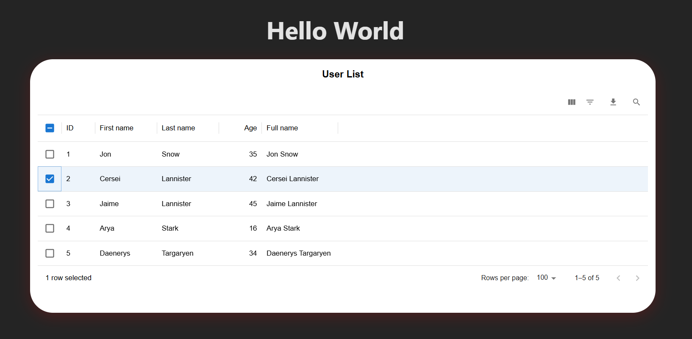

# material-datatables

A fully-featured, customizable Material UI Data Table React component with sorting, filtering, pagination, selection, column management, and more. Built for flexibility, performance, and a beautiful, professional UI.

---

## ✨ Features
- Dynamic columns and rows
- Pagination with selectable page sizes
- Column sorting (ASC/DESC)
- Per-column and global filtering
- Column visibility toggle and management
- Row selection (checkboxes, select all)
- **Modern, responsive, and attractive UI**
- **Large, white, rounded card layout with shadow**
- **Customizable, bold, centered table title inside the card**
- **Toolbar with aligned controls (column selector, search, download, actions)**
- **Dark background with light table for high contrast**
- **CSS module-based styling for easy customization**
- Responsive design
- Customizable styles via `sx`, `themeOverrides`, and props
- Custom toolbar actions, search, and CSV download
- Accessibility (ARIA attributes)
- Virtualization-ready for large data sets
- TypeScript support

---

## 🖼️ Screenshot



---

## 🚀 Installation

```bash
npm install material-datatables
```

---

## 🛠️ Usage

```tsx
import React from 'react';
import { MuiDataTable } from 'material-datatables';
import './App.css'; 

// Define the column types based on the expected MuiDataTableColumn interface
interface MuiDataTableColumn {
  field: string;
  headerName: string;
  sortable?: boolean;
  filterable?: boolean;
  visible?: boolean;
  sx?: React.CSSProperties;
  className?: string;
  renderCell?: (value: any, row: any, rowIndex: number) => React.ReactNode;
}

// Define the row type based on the expected MuiDataTableRow interface
interface MuiDataTableRow {
  id?: string | number;
  [key: string]: any;
}

// Define the pagination type
interface Pagination {
  page: number;
  pageSize: number;
  pageSizeOptions?: number[];
}

// Define the sort model type
interface MuiDataTableSortModel {
  field: string;
  direction: 'asc' | 'desc';
}

// Define the filter model type
interface MuiDataTableFilterModel {
  [key: string]: string;
}

// Define the toolbar action type
interface MuiDataTableToolbarAction {
  label: string;
  icon: React.ReactNode;
  onClick: () => void;
}

const columns: MuiDataTableColumn[] = [
  { field: 'id', headerName: 'ID', sortable: true },
  { field: 'name', headerName: 'Name', filterable: true },
  { field: 'email', headerName: 'Email', filterable: true },
];

const rows: MuiDataTableRow[] = [
  { id: 1, name: 'Alice', email: 'alice@example.com' },
  { id: 2, name: 'Bob', email: 'bob@example.com' },
  { id: 3, name: 'Charlie', email: 'charlie@example.com' },
];

export default function App() {
  // State to manage controlled props
  const [pagination, setPagination] = React.useState<Pagination>({ page: 0, pageSize: 10, pageSizeOptions: [5, 10, 25] });
  const [sortModel, setSortModel] = React.useState<MuiDataTableSortModel | undefined>(undefined);
  const [filterModel, setFilterModel] = React.useState<MuiDataTableFilterModel>({});
  const [columnVisibilityModel, setColumnVisibilityModel] = React.useState<Record<string, boolean>>({
    id: true,
    name: true,
    email: true,
  });
  const [selectedRows, setSelectedRows] = React.useState<MuiDataTableRow[]>([]);

  // Handlers for controlled props
  const handlePaginationChange = (newPagination: Pagination) => {
    setPagination(newPagination);
  };

  const handleSortModelChange = (newSortModel: MuiDataTableSortModel) => {
    setSortModel(newSortModel);
  };

  const handleFilterModelChange = (newFilterModel: MuiDataTableFilterModel) => {
    setFilterModel(newFilterModel);
  };

  const handleColumnVisibilityChange = (newColumnVisibilityModel: Record<string, boolean>) => {
    setColumnVisibilityModel(newColumnVisibilityModel);
  };

  const handleRowClick = (row: MuiDataTableRow, rowIndex: number) => {
    console.log('Row clicked:', row, 'at index:', rowIndex);
  };

  const handleSelectionChange = (selectedRows: MuiDataTableRow[]) => {
    setSelectedRows(selectedRows);
    console.log('Selected rows:', selectedRows);
  };

  // Custom toolbar action
  const customToolbarActions: MuiDataTableToolbarAction[] = [
    {
      label: 'Custom Action',
      icon: <span>⚙️</span>,
      onClick: () => console.log('Custom action triggered'),
    },
  ];

  return (
    <MuiDataTable
      title="User List"
      columns={columns}
      rows={rows}
      loading={false} // Example: not loading
      pagination={pagination}
      onPaginationChange={handlePaginationChange}
      sortModel={sortModel}
      onSortModelChange={handleSortModelChange}
      filterModel={filterModel}
      onFilterModelChange={handleFilterModelChange}
      onRowClick={handleRowClick}
      onSelectionChange={handleSelectionChange}
      checkboxSelection={true}
      disableSelectionOnClick={false}
      columnVisibilityModel={columnVisibilityModel}
      onColumnVisibilityChange={handleColumnVisibilityChange}
      toolbarActions={customToolbarActions}
      showSearch={true}
      showDownload={true}
      sx={{ borderRadius: 8, boxShadow: '0 2px 10px rgba(0, 0, 0, 0.1)' }}
      className="custom-table-class" // Optional custom class
      style={{ margin: '20px auto' }} // Optional inline styles
      themeOverrides={{ table: { border: '1px solid #e0e0e0' } }} // Optional theme overrides
      virtualization={false} // Example: disable virtualization
      rowHeight={48}
      tableColor="#ffffff"
      tableTextColor="#212121"
      ariaLabel="User Data Table" // Optional ARIA label
    />
  );
}
```

---

## 🧩 UI Structure

- The table is displayed inside a **large, white, rounded card** with a subtle shadow, centered on a dark background.
- The **title** appears as a bold, centered heading at the top of the card, customizable via the `title` prop.
- The **toolbar** sits below the title, with all controls (column selector, search, download, custom actions) aligned in a single row and visually separated by a border.
- The **table** is full-width, with clear headers, zebra striping, hover and selected row effects, and responsive design.
- **Pagination** controls are aligned to the bottom right of the card.
- All controls are accessible and visually organized for a professional, MUI-like appearance.

---

## 📑 Props API

| Prop                    | Type                        | Description |
|-------------------------|-----------------------------|-------------|
| `title`                 | `string`                    | Table title, shown as a bold, centered heading inside the card |
| `columns`               | `MuiDataTableColumn[]`      | Column definitions |
| `rows`                  | `MuiDataTableRow[]`         | Table data rows |
| `loading`               | `boolean`                   | Show loading overlay |
| `pagination`            | `object`                    | Pagination state |
| `onPaginationChange`    | `(pagination) => void`      | Pagination callback |
| `sortModel`             | `object`                    | Sorting state |
| `onSortModelChange`     | `(sortModel) => void`       | Sorting callback |
| `filterModel`           | `object`                    | Filtering state |
| `onFilterModelChange`   | `(filterModel) => void`     | Filtering callback |
| `onRowClick`            | `(row, rowIndex) => void`   | Row click handler |
| `onSelectionChange`     | `(selectedRows) => void`    | Row selection callback |
| `checkboxSelection`     | `boolean`                   | Enable row selection |
| `disableSelectionOnClick`| `boolean`                  | Disable row click selection |
| `columnVisibilityModel` | `object`                    | Column visibility state |
| `onColumnVisibilityChange`| `(model) => void`          | Column visibility callback |
| `toolbarActions`        | `MuiDataTableToolbarAction[]`| Custom toolbar actions |
| `showSearch`            | `boolean`                   | Show global search |
| `showDownload`          | `boolean`                   | Show CSV download |
| `sx`                    | `object`                    | Custom styles |
| `className`             | `string`                    | Custom class name |
| `style`                 | `object`                    | Inline styles |
| `themeOverrides`        | `object`                    | Theme/style overrides |
| `virtualization`        | `boolean`                   | Enable virtualization |
| `rowHeight`             | `number`                    | Row height (px) |
| `tableColor`            | `string`                    | Table background color |
| `tableTextColor`        | `string`                    | Table text color |
| `ariaLabel`             | `string`                    | ARIA label for accessibility |

---

## 🎨 Customization
- **Styling:**
  - The table uses a CSS module (`MuiDataTable.module.css`) for all layout and visual styles, including the card, title, toolbar, table, and pagination.
  - You can override styles by providing your own CSS module or by using the `className`, `sx`, or `themeOverrides` props.
  - The default look is a dark background with a large, white, rounded card, a bold, centered title, and a modern, MUI-like toolbar and table.
- **Title:** Use the `title` prop to set a custom table title, which appears as a bold, centered heading inside the card.
- **Toolbar:** Add custom actions, search, and download. All controls are aligned and visually separated for clarity.
- **Columns:** Use `renderCell` for custom cell rendering.
- **Accessibility:** ARIA attributes included by default.

---

## 👤 Author
**Akshay Bhalala**  
[akshaybhalala@gmail.com](mailto:akshaybhalala@gmail.com)

---

## 🔑 Keywords
react, material-ui, data-table, table, mui, datatable, component, typescript

---

## 📄 License
MIT

---

## 💡 Contributing
Pull requests and issues are welcome! Please open an issue or PR on [GitHub](https://github.com/yourusername/material-datatables).
